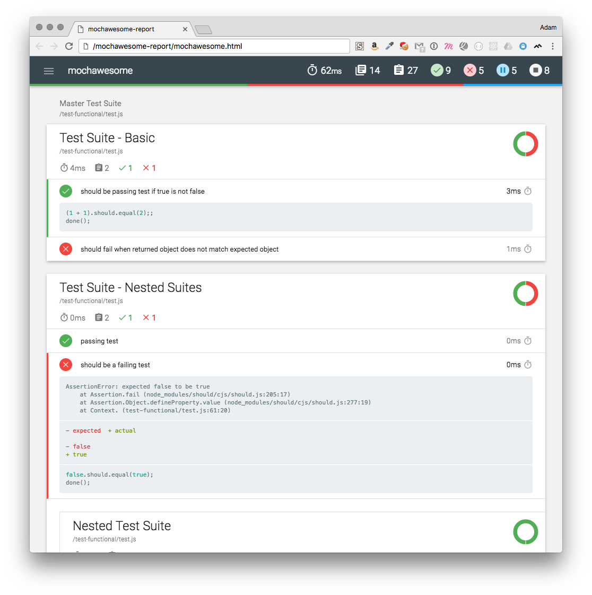
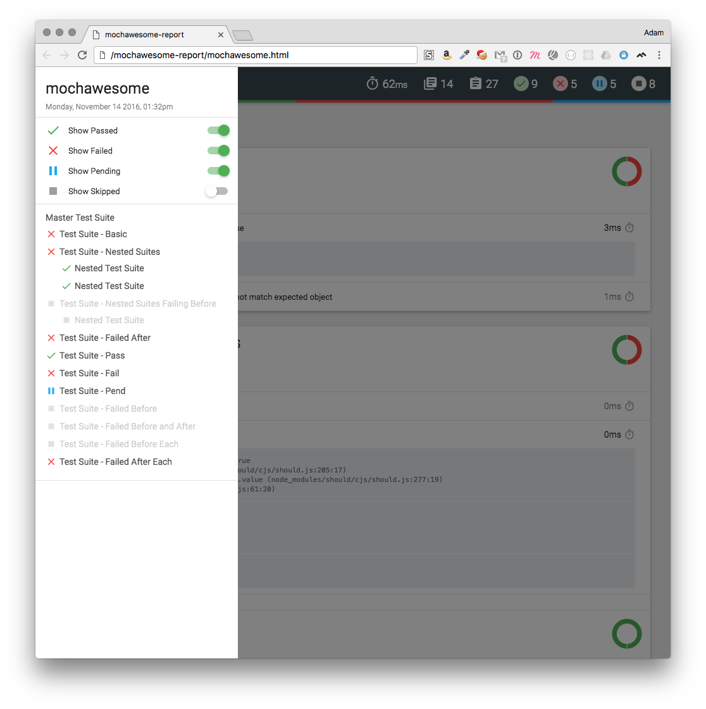

mochawesome
===========
[](http://www.npmjs.com/package/mochawesome) [](https://travis-ci.org/adamgruber/mochawesome) [](https://codeclimate.com/github/adamgruber/mochawesome)

Mochawesome is a custom reporter for use with the Javascript testing framework, [mocha][1]. It generates a full fledged HTML/CSS report that helps visualize your test suites.

##Version 2.0 is here! :tada:
With the arrival of 2.0 comes some often requested features, a code rewrite, and a complete redesign of the report.

###mochawesome-report-generator (marge)
To start, the actual report generation has been moved out into its own package, [mochawesome-report-generator][2]. This will make it easier to implement changes to the report as well as allow for future integration with other test libraries.

###New Features
- Every bit of the report has been redesigned for a cleaner, more streamlined look
- Built using React and mobx
- Supports displaying [additional test context](#adding-test-context) including images!
- Supports displaying inline diffs for failed tests
- New [options](#options) including hiding test code and/or charts 
- Enhanced navigation menu with clearer filtering options
- New option to disable console messages
- Test coverage!

###Plus...
- At-a-glance stats including pass percentage
- Beautiful charts
- Supports nested `describe`s
- Supports pending tests
- Review test code inline
- Stack trace for failed tests
- Responsive and mobile-friendly
- Saves JSON output for further processing
- Offline viewing

###Sample Report




###Browser Support
Tested to work in Chrome. *Should* work in any modern web browser including IE9+.
Mochawesome generates a self-contained report that can be viewed offline. 

##Usage

1. Add Mochawesome to your project:

  `npm install --save-dev mochawesome`

2. Tell mocha to use the Mochawesome reporter:

  `mocha testfile.js --reporter mochawesome`

3. If using mocha programatically:

  ```js
  var mocha = new Mocha({
    reporter: 'mochawesome'
  });
  ```

##Output
Mochawesome generates the following inside your project directory:
```
mochawesome-report/
├── assets
│   ├── app.css
│   ├── app.js
│   ├── MaterialIcons-Regular.woff
│   ├── MaterialIcons-Regular.woff2
│   ├── roboto-light-webfont.woff
│   ├── roboto-light-webfont.woff2
│   ├── roboto-medium-webfont.woff
│   ├── roboto-medium-webfont.woff2
│   ├── roboto-regular-webfont.woff
│   └── roboto-regular-webfont.woff2
├── mochawesome.html
└── mochawesome.json
```

The two main files to be aware of are:

**mochawesome.html** - The rendered report file

**mochawesome.json** - The raw json output used to render the report


##Options
Mochawesome supports options via environment variables or passed in to mocha via `--reporter-options`.

Option Name | Type | Default | Description 
:---------- | :--- | :------ | :----------
`reportDir` | string | [cwd]/mochawesome-report | Path to save report
`reportFilename` | string | mochawesome | Filename of saved report *(prior to version 2.0.0 this was called `reportName`)*
`reportTitle` | string | mochawesome | Report title
`reportPageTitle` | string | mochawesome-report | Browser title
`inlineAssets` | boolean | false | Inline report assets (scripts, styles)
`enableCharts` | boolean | true | Display Suite charts
`enableTestCode` | boolean | true | Display test code
`autoOpen` | boolean | false | Open the report after running tests
`quiet` | boolean | false | Silence console messages

*Setting a custom filename will change both the report html and json files.*

**Options passed in will take precedence over environment variables.**

####Environment variables
```bash
$ export MOCHAWESOME_REPORTDIR=customReportDir
$ export MOCHAWESOME_REPORTFILENAME=customReportFilename
$ export MOCHAWESOME_REPORTTITLE=customReportTitle
$ export MOCHAWESOME_REPORTPAGETITLE=customReportPageTitle
$ export MOCHAWESOME_INLINEASSETS=true
$ export MOCHAWESOME_AUTOOPEN=true
$ export MOCHAWESOME_ENABLECHARTS=false
$ export MOCHAWESOME_ENABLECODE=false
$ export MOCHAWESOME_QUIET=true
```

####Mocha options
```bash
$ mocha test.js --reporter mochawesome --reporter-options reportDir=customReportDir,reportFilename=customReportFilename,reportTitle=customReportTitle,reportPageTitle=customReportPageTitle,inlineAssets=true,autoOpen=true,enableCharts=false,enableTestCode=false,quiet=true
```

```js
var mocha = new Mocha({
  reporter: 'mochawesome',
  reporterOptions: {
    reportDir: 'customReportDir',
    reportFilename: 'customReportFilename',
    reportTitle: 'customReportTitle',
    reportPageTitle: 'customReportPageTitle',
    inlineAssets: true,
    autoOpen: false,
    enableCharts: true,
    enableTestCode: true,
    quiet: true
  }
});
```

##Adding Test Context
One of the more request features has been the ability to display additional information about a test within the report. As of version 2.0.0 this is now possible. **TODO: Fill in how to do it**

[1]: http://visionmedia.github.io/mocha/
[2]: https://github.com/adamgruber/mochawesome-report-generator