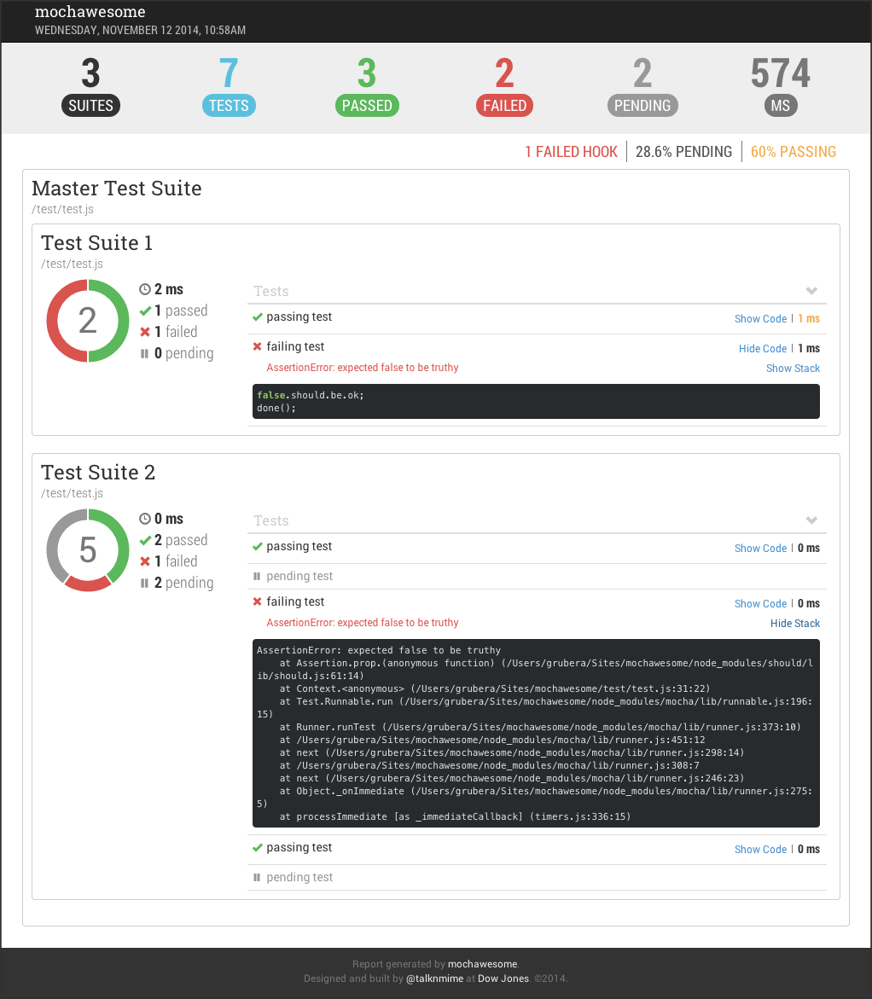

mochawesome
===========
[](http://www.npmjs.com/package/mochawesome) [](https://travis-ci.org/adamgruber/mochawesome) [](https://codeclimate.com/github/adamgruber/mochawesome)

Mochawesome is a custom reporter for use with the Javascript testing framework, [mocha][1]. It generates a full fledged HTML/CSS report that helps visualize your test suites.

##New in 1.3.0
- Changes to support [mocha][1] v2.4.0 and later

##Features
- At-a-glance stats including pass percentage
- Beautiful charts
- Support for nested `describe`s
- Supports pending tests
- Filter view by test type
- Review test code inline
- Stack trace for failed tests
- Responsive and mobile-friendly
- Saves JSON output for further processing
- Custom report [options](#options)
- Offline viewing

##Browser Support
Tested to work in Chrome. *Should* work in any modern web browser including IE9+.
Mochawesome generates a self-contained report that can be viewed offline. 

##Sample Report




##Usage

1. Add Mochawesome to your project:

  `npm install --save-dev mochawesome`

2. Tell mocha to use the Mochawesome reporter:

  `mocha testfile.js --reporter mochawesome`

3. If using mocha programatically:

  ```js
  var mocha = new Mocha({
      reporter: 'mochawesome'
  });
  ```

##Output
Mochawesome generates the following inside your project directory:
```
mochawesome-reports/
├── css
│   └── mochawesome.css
├── fonts
│   ├── Roboto+Condensed_300_normal.ttf
│   ├── Roboto+Condensed_300_normal.woff
│   ├── Roboto+Condensed_400_normal.svg
│   ├── Roboto+Condensed_400_normal.ttf
│   ├── Roboto+Condensed_400_normal.woff
│   ├── Roboto+Condensed_700_normal.ttf
│   ├── Roboto+Condensed_700_normal.woff
│   ├── Roboto+Slab_400_normal.svg
│   ├── Roboto+Slab_400_normal.ttf
│   ├── Roboto+Slab_400_normal.woff
│   ├── mochawesome.eot
│   ├── mochawesome.svg
│   ├── mochawesome.ttf
│   └── mochawesome.woff
├── js
│   ├── mochawesome.js
│   └── vendor.js
├── mochawesome.html
└── mochawesome.json
```

The two main files to be aware of are:

**mochawesome.html** - The rendered report file

**mochawesome.json** - The raw json output used to render the report


##Options
Mochawesome supports options via environment variables or passed in to mocha via `--reporter-options`.

- `reportDir: {String}` - changes the name of the report directory
- `reportName: {String}` - changes the name of the report file
- `reportTitle: {Sring}` - changes the title of the report
- `inlineAssets: {Boolean}` - when `true` inlines all report assets into a self-contained report file

*Setting a custom filename will change both the report html and json files.*

**Options passed in will take precedence over environment variables.**


####Environment variables
```bash
$ export MOCHAWESOME_REPORTDIR=customReportDir
$ export MOCHAWESOME_REPORTNAME=customReportName
$ export MOCHAWESOME_REPORTTITLE=customReportTitle
$ export MOCHAWESOME_INLINEASSETS=true
```

####Mocha options
```bash
$ mocha test.js --reporter mochawesome --reporter-options reportDir=customReportDir,reportName=customReportName,reportTitle=customReportTitle,inlineAssets=true
```

```js
var mocha = new Mocha({
    reporter: 'mochawesome',
    reporterOptions: {
      reportDir: 'customReportDir',
      reportName: 'customReportName',
      reportTitle: 'customReportTitle',
      inlineAssets: true
    }
});
  ```


##Development
If you wish to make changes to the reporter you will need to clone the repo and build locally. Building requires you to have [gulp](https://github.com/gulpjs/gulp) installed.

###Installation
```sh
$ git clone https://github.dowjones.net/grubera/mochawesome
```
###Modifying
Reporter files are found in `/lib` directory.
Templates, styles, and client-side scripts are in the `/src` directory.

###Building
There are several gulp tasks available but the main ones to be aware of are:

####`gulp build` - Full Build
Runs jshint, parses LESS, compiles templates, concatenates and minifies scripts.
*Note: This task will fail if linting fails.*

####`gulp watch` - Watch Files
Watches for changes to JS, LESS, and MU and builds when a change is detected. If a change is detected in a JS file this will run jshint first before building and will fail on any lint errors.

####`gulp lint` - Lint JS
This will run jshint only, no building will occur.

####`gulp test` - Run Test
After building you can run this to test the reporter and see the output.
*Note: The default gulp task will run this task.*

####`gulp testOpts` - Run Test with Options
After building you can run this to test the reporter and see the output.

[1]: http://visionmedia.github.io/mocha/