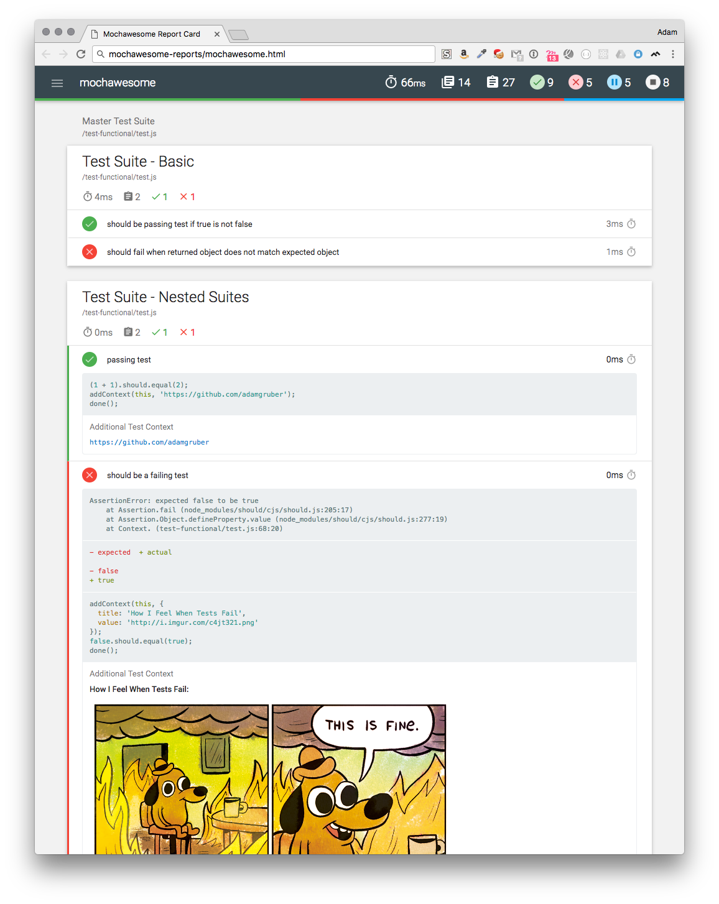
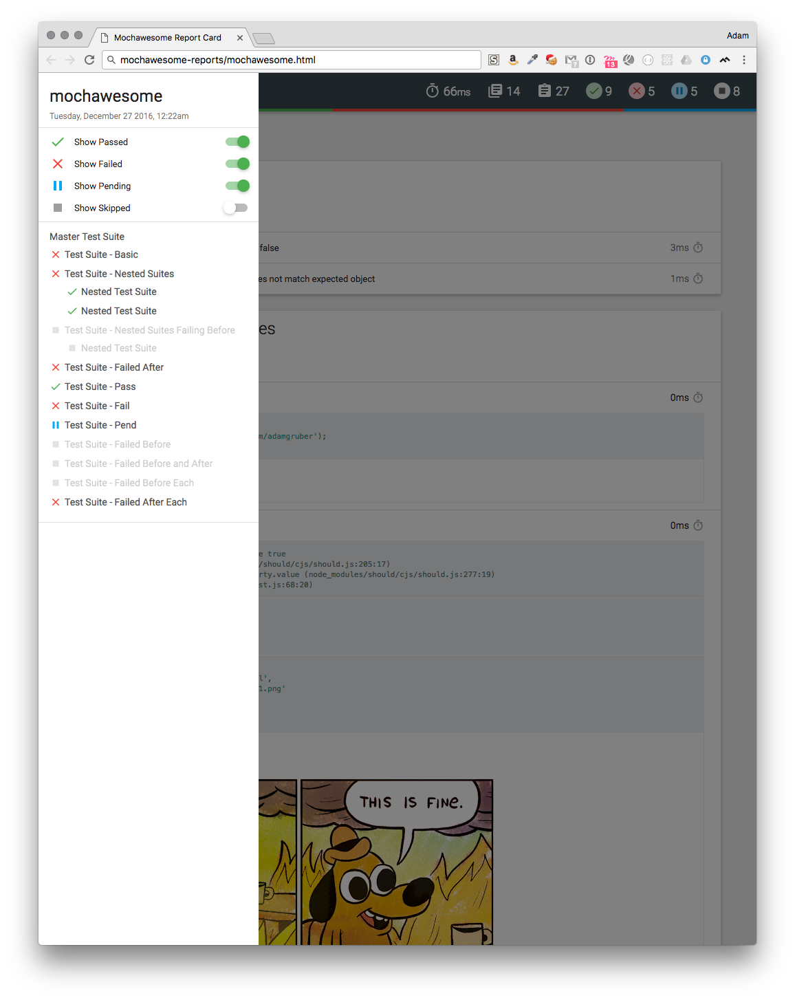

mochawesome
===========
[](http://www.npmjs.com/package/mochawesome) [](https://travis-ci.org/adamgruber/mochawesome) [](https://gitter.im/mochawesome/general) [](https://codeclimate.com/github/adamgruber/mochawesome)

Mochawesome is a custom reporter for use with the Javascript testing framework, [mocha][]. It runs on Node.js (>=4) and generates a full fledged HTML/CSS report that helps visualize your test suites.

## :tada: Latest Changes
- Support for mocha's `--inline-diffs` option
- Display before and after hooks alongside your tests
- Use `addContext` in test hooks
- New [option](#options): `showHooks`

See the [CHANGELOG][] for up-to-date changes.

### mochawesome-report-generator (marge)
To start, the actual report generation has been moved out into its own package, [mochawesome-report-generator][]. This will make it easier to implement changes to the report as well as allow for future integration with other test libraries.

### New Features
- Every bit of the report has been redesigned for a cleaner, more streamlined look
- Built using React and mobx
- Supports displaying [additional test context](#adding-test-context) including images!
- Supports displaying inline diffs for failed tests
- New [options](#options) including hiding test code and/or charts 
- Enhanced navigation menu with clearer filtering options
- New option to disable console messages

### Plus...
- At-a-glance stats including pass percentage
- Beautiful charts
- Supports nested `describe`s
- Supports pending tests
- Review test code inline
- Stack trace for failed tests
- Responsive and mobile-friendly
- Saves JSON output for further processing
- Offline viewing

### Sample Report




### Browser Support
The generated report has been tested to work in Chrome. It *should* work in any modern web browser, including IE9+. It is also fully self-contained for offline viewing. 

## Usage

1. Add Mochawesome to your project:

  `npm install --save-dev mochawesome`

2. Tell mocha to use the Mochawesome reporter:

  `mocha testfile.js --reporter mochawesome`

3. If using mocha programatically:

  ```js
  var mocha = new Mocha({
    reporter: 'mochawesome'
  });
  ```

## Output
Mochawesome generates the following inside your project directory:
```
mochawesome-report/
├── assets
│   ├── app.css
│   ├── app.js
│   ├── MaterialIcons-Regular.woff
│   ├── MaterialIcons-Regular.woff2
│   ├── roboto-light-webfont.woff
│   ├── roboto-light-webfont.woff2
│   ├── roboto-medium-webfont.woff
│   ├── roboto-medium-webfont.woff2
│   ├── roboto-regular-webfont.woff
│   └── roboto-regular-webfont.woff2
├── mochawesome.html
└── mochawesome.json
```

The two main files to be aware of are:

**mochawesome.html** - The rendered report file

**mochawesome.json** - The raw json output used to render the report


## Options
Mochawesome supports options via environment variables or passed directly to mocha.

Option Name | Type | Default | Description 
:---------- | :--- | :------ | :----------
`reportDir` | string | [cwd]/mochawesome-report | Path to save report
`reportFilename` | string | mochawesome | Filename of saved report *(prior to version 2.0.0 this was called `reportName`)*
`reportTitle` | string | mochawesome | Report title
`reportPageTitle` | string | mochawesome-report | Browser title
`inlineAssets` | boolean | false | Inline report assets (scripts, styles)
`enableCharts` | boolean | true | Display Suite charts
`enableCode` | boolean | true | Display test code
`enableTestCode` | boolean | true | Same as `enableCode` *deprecated*
`autoOpen` | boolean | false | Open the report after running tests
`overwrite` | boolean | true | Overwrite existing report files
`timestamp` | string | | Append timestamp in specified format to report filename. *See [notes][1].*
`showHooks` | string | failed | Set the default display mode for hooks
`quiet` | boolean | false | Silence console messages

*Setting a custom filename will change both the report html and json files.*

**Options passed in will take precedence over environment variables.**

#### Environment variables
Options can be set via environment variable. To do this you must prefix the variable with `MOCHAWESOME_` and then uppercase the variable name.
```bash
$ export MOCHAWESOME_REPORTDIR=customReportDir
$ export MOCHAWESOME_INLINEASSETS=true
$ export MOCHAWESOME_AUTOOPEN=true
```

#### Mocha options
You can pass comma-separated options to the reporter via mocha's `--reporter-options` flag.
```bash
$ mocha test.js --reporter mochawesome --reporter-options reportDir=customReportDir,reportFilename=customReportFilename
```
Options can be passed in programatically as well:

```js
var mocha = new Mocha({
  reporter: 'mochawesome',
  reporterOptions: {
    reportDir: 'customReportDir',
    reportFilename: 'customReportFilename',
    enableCharts: false
  }
});
```

## Adding Test Context
One of the more request features has been the ability to display additional information about a test within the report. As of version 2.0.0 this is now possible with the `addContext` helper method. This method will add extra information to the test object that will then be displayed inside the report.

### `addContext(testObj, context)`

param | type | description
:---- | :--- | :----------
testObj | object | The test object
context | string\|object | The context to be added to the test

**Context as a string**

Simple strings will be displayed as is. If you pass a URL, the reporter will attempt to turn it into a link. If the URL links to an image, it will be shown inline.

**Context as an object**

Context passed as an object must adhere to the following shape:
```js
{
  title: 'some title' // must be a string
  value: {} // can be anything
}
```

#### Example
*When using the `addContext` helper, you cannot use an arrow function in your `it` statement because your `this` value will not be the test object.*
```js
const addContext = require('mochawesome/addContext');

describe('test suite', function () {
  it('should add context', function () {
    // context can be a simple string
    addContext(this, 'simple string');

    // context can be a url and the report will create a link
    addContext(this, 'http://www.url.com/pathname');

    // context can be an image url and the report will show it inline
    addContext(this, 'http://www.url.com/screenshot-maybe.jpg');

    // context can be an object with title and value properties
    addContext(this, {
      title: 'expected output',
      value: {
        a: 1,
        b: '2',
        c: 'd'
      }
    });
  })
});
```

As of version 2.2.0 it is possible to use `addContext` from within a `beforeEach` or `afterEach` test hook.
```js
describe('test suite', () => {
  beforeEach(function () {
    addContext(this, 'some context')
  });

  afterEach(function () {
    addContext(this, {
      title: 'afterEach context',
      value: { a: 1 }
    });
  });

  it('should display with beforeEach and afterEach context', () => {
    // assert something
  });
});
```

## v1.x
Documentation for version 1.x can be found [here](https://github.com/adamgruber/mochawesome/tree/v1.X).

[mocha]: https://mochajs.org/
[mochawesome-report-generator]: https://github.com/adamgruber/mochawesome-report-generator
[CHANGELOG]: CHANGELOG.md
[1]: https://github.com/adamgruber/mochawesome-report-generator/blob/master/README.md#timestamp
